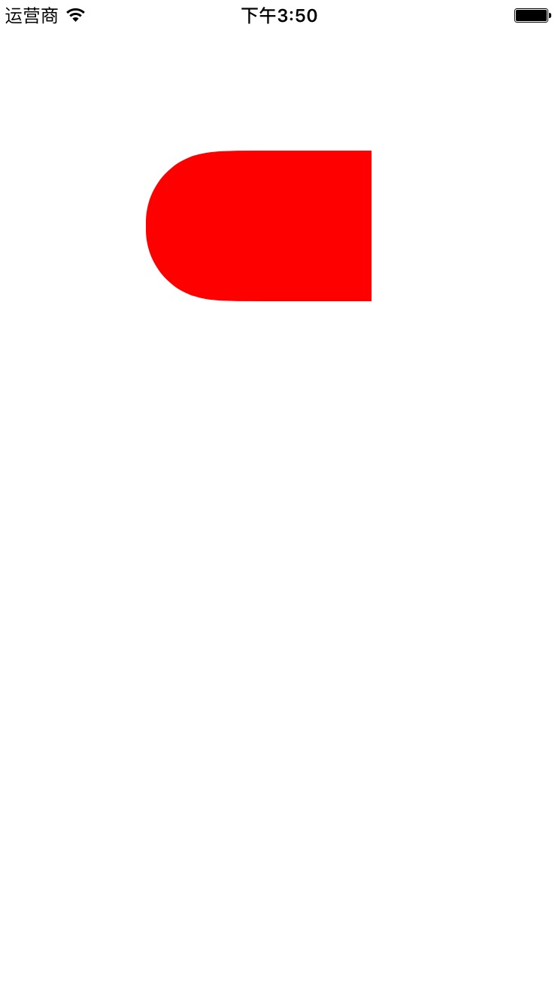

# halfRoundButton
## 半圆角按钮
 
 
```
    UIBezierPath *maskPath = [UIBezierPath bezierPathWithRoundedRect:button.bounds byRoundingCorners:UIRectCornerTopLeft | UIRectCornerBottomLeft cornerRadii:CGSizeMake(50, 0)];
    CAShapeLayer *maskLayer = [[CAShapeLayer alloc] init];
    maskLayer.frame = button.bounds;
    maskLayer.path = maskPath.CGPath;
    button.layer.mask = maskLayer;
    button.layer.masksToBounds = YES;
